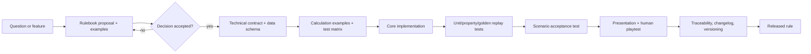
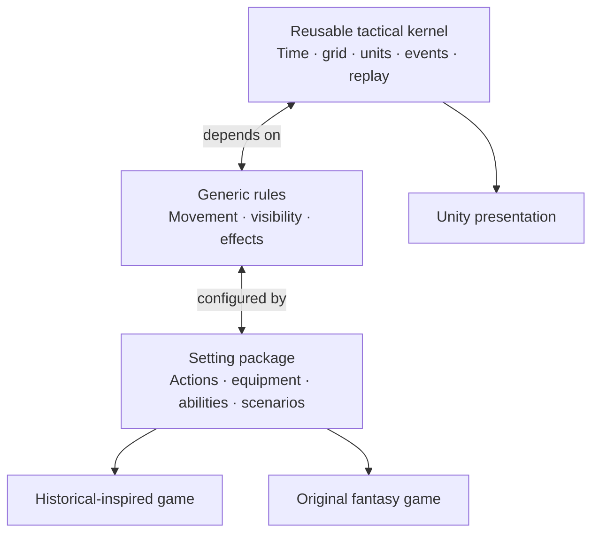

# Rule Delivery Lifecycle

```mermaid
flowchart LR
    A[Question or feature] --> B[Rulebook proposal + examples]
    B --> C{Decision accepted?}
    C -- no --> B
    C -- yes --> D[Technical contract + data schema]
    D --> E[Calculation examples + test matrix]
    E --> F[Core implementation]
    F --> G[Unit/property/golden replay tests]
    G --> H[Scenario acceptance test]
    H --> I[Presentation + human playtest]
    I --> J[Traceability, changelog, versioning]
    J --> K[Released rule]
```

```mermaid
flowchart TB
    Core[Reusable tactical kernel\nTime · grid · units · events · replay] <-- depends on --> Rules[Generic rules\nMovement · visibility · effects]
    Rules <-- configured by --> Setting[Setting package\nActions · equipment · abilities · scenarios]
    Setting --> Historical[Historical-inspired game]
    Setting --> Fantasy[Original fantasy game]
    Core --> Unity[Unity presentation]
```
